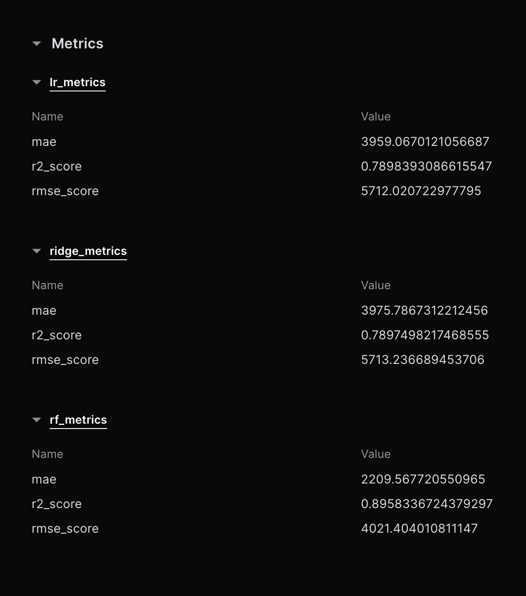
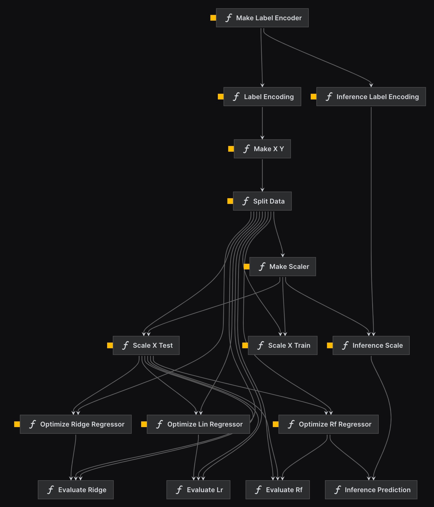
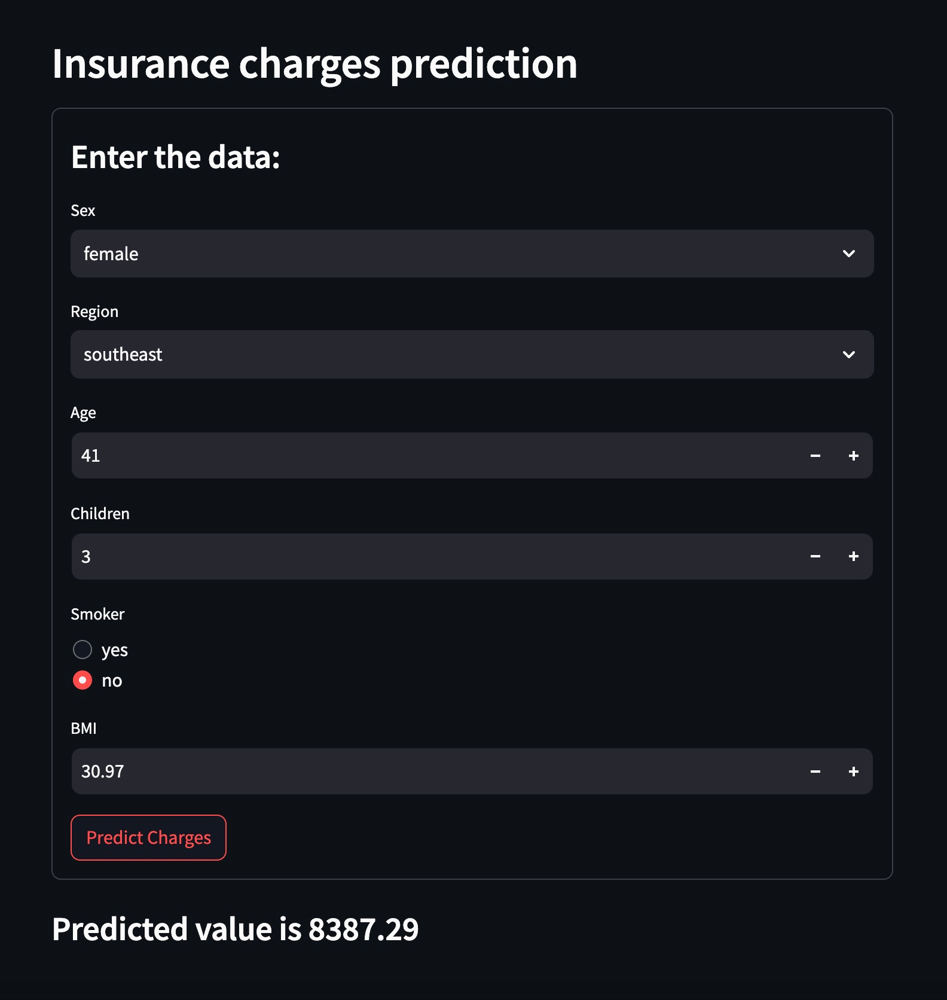

# US insurance charges
## ML-zoomcamp 2023, capstone project

### Intro

The goal of the project is to predict Insurance Premium Charges in US using Kedro framework.

Data source: https://www.kaggle.com/datasets/teertha/ushealthinsurancedataset 
This dataset contains 1338 rows of insured data, where the Insurance charges are given against the following attributes of the insured: 
- Age
- Sex
- BMI
- Number of Children
- Smoker
- Region. 


Technology stack:
- [`Kedro`](https://kedro.org/)  is an open-source Python framework to create reproducible, maintainable, and modular data science code.
- [`Streamlit`](https://streamlit.io/)
- Docker compose
- (cloud)

### Developemnt

- Simple EDA is available at [the repo](src/us-insurance/notebooks/1_EDA.ipynb)  
OR  
start Jupyter notebook server and access it in the browser: http://localhost:8888/notebooks/notebooks/1_EDA.ipynb: 
```sh
docker-compose up ds
```
    
#### Kedro pipelines
Kedro framework was used to build the following pipeleines:
```sh
docker-compose run ds kedro registry list
```

- data_processing pipeline:
    - preprocess data 
    ```sh
    docker-compose run ds kedro run -p data_processing
    ```
- data_science pipeline
    - train and optimize hyperparameters of linear regression, ridge regression and random forest model
    ```sh
    docker-compose run ds kedro run -p data_science
    ```
    Random forest is the best performing model based on RMSE score. Thus, it is used for inference.
    
- inference pipeline make prediction on user input being provided via the web app 
    ```sh
    docker-compose run ds kedro run -p inference
    ```
  
  
Here is the directed acyclic graph of the pipelines nodes:



### Model deployment
The model is deployed as a Straimlit app.
Start the container and acceess the app: http://localhost:8501
```sh
docker-compose up app
```

Here is the screenshot of the app


- Also, a Kedro project can be deployed in the cloud: e.g,  `AWS Step functions` according to [the detailed instruction](https://docs.kedro.org/en/stable/deployment/aws_step_functions.html)
